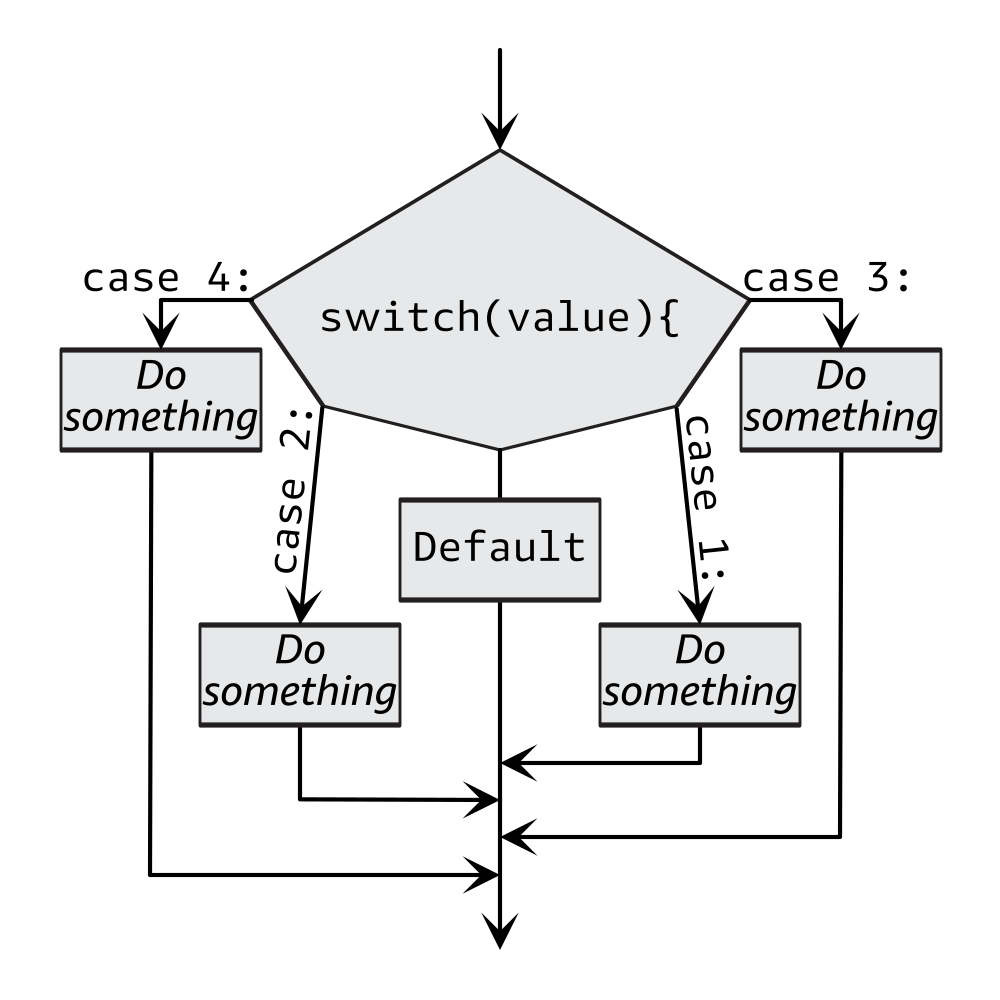

# Java Selection and Control Structures

## Conditional Branches

### if


**Sample:**

```java
public class IfStatement {
    
    public static void main(String[] args) {
        java.util.Random random = new java.util.Random();
        int number = random.nextInt(2);
        System.out.printf("%nTest number: %d%n", number);

        // 0 is false
        // 1 is true

        if (number == 1) {
            System.out.print(true);
        }

        System.out.printf("%n%nThe conditional is complete.%n");
    }
}

```


### if else


**Sample:**

```java
public class IfElse {

    public static void main(String[] args) {
        java.util.Random random = new java.util.Random();
        int number = random.nextInt(2);
        System.out.printf("%nTest number: %d%n", number);

        // 0 is false
        // 1 is true

        if (number == 0) {
            System.out.print(false);
        } else {
            System.out.print(true);
        }
        
        System.out.printf("%nThe conditional is complete.%n");
    }
}

```


### ternary operator


**Sample:**

```java
public class TernaryOperator {
    
    public static void main(String[] args) {
        java.util.Random random = new java.util.Random();
        int number = random.nextInt(2);
        System.out.printf("%nTest number: %d%n", number);

        // 0 is false
        // 1 is true

        System.out.println(number == 1 ? true : false);

        System.out.printf("%n%nThe conditional is complete.%n");
    }
}

```


### if else if


**Sample:**

```java
public class IfElseIf {

    public static void main(String[] args) {
        java.util.Random random = new java.util.Random();
        int number = random.nextInt(2);
        System.out.printf("%nTest number: %d%n", number);

        // 0 is false
        // 1 is true

        if (number == 0) {
            System.out.print(false);
        } else if (number == 1) {
            System.out.print(true);
        }

        System.out.printf("%n%nThe conditional is complete.%n");
    }
}

```


### if ladder


**Sample:**

```java
public class IfLadder {
    
    public static void main(String[] args) {
        java.util.Random random = new java.util.Random();
        int number = random.nextInt(3);
        System.out.printf("%nTest number: %d%n", number);

        // 0 is false
        // 1 is true
        // 2 is neither true nor false

        if (number == 0) {
            System.out.print(false);
        } else if (number == 1) {
            System.out.print(true);
        } else {
            System.out.print("Neither true nor false");
        }
         
        System.out.printf("%n%nThe conditional is complete.%n");
    }
}

```


### switch 



**Sample:**

```java
public class SwitchStatement {
    
    public static void main(String[] args) {
        java.util.Random random = new java.util.Random();
        int number = random.nextInt(6);
        System.out.printf("%nTest number: %d%n", number);

        switch (number) {
            case 1:
                System.out.print("One");
                break;
            case 2:
                System.out.print("Two");
                break;
            case 3:
                System.out.print("Three");
                break;
            case 4:
                System.out.print("Four");
                break;
            default:
                // if random number is 0 or 5
                System.out.print("Number is not between 1 and 4");
                break;
        }
        
            System.out.printf("%nThe conditional is complete.%n");
    }
}

```

**Sample (≥ Java 14)**

```java
public class EnhancedSwitchStatement {
// requires Java 14 or above    

    public static void main(String[] args) {
        java.util.Random random = new java.util.Random();
        int number = random.nextInt(6);
        System.out.printf("%nTest number: %d%n", number);

        switch (number) {
            case 1 -> System.out.print("One");
            case 2 -> System.out.print("Two");
            case 3 -> System.out.print("Three");
            case 4 -> System.out.print("Four");
            default -> System.out.print("Number is not between 1 and 4");  // if random number is 0 or 5
        }
        
            System.out.printf("%nThe conditional is complete.%n");
    }
}

```


### try catch


**Sample:**

```java
public class TryCatch {
    public static void main(String[] args) throws java.lang.NumberFormatException {
        java.util.Scanner scanner = new java.util.Scanner(System.in);
        try {
            System.out.println("Enter anything. " +
                               "Integers pass, " +
                               "anything else fails." +
                               "\n\"throw\" throws an exception, and " +
                               "\"exit\" terminates the program on fail.");
            int number = Integer.parseInt(scanner.nextLine());
            // Print a "pass" message to the console.
            System.out.printf("Pass! number = %d%n", number);
        } catch (NumberFormatException nfe) {
            // Print a "fail" message to the console.
            System.out.printf("Fail! \u001B[31m%s\u001B[0m%n", nfe);
            String exitOrThrow = nfe.toString()
                    .substring(nfe.toString().length() - 6);
            if(exitOrThrow
                    .equalsIgnoreCase("\"exit\"")) {  // user entered "exit".
                System.exit(1);
            } else if(exitOrThrow
                    .equalsIgnoreCase("throw\"")) {  // user entered "throw".
                throw new java.lang.NumberFormatException(nfe.toString());
            }
        } finally {
            System.out.println("Thank you for using the Java Try-Catch system. Goodbye!");
            scanner.close(); // <- The finally block is a good place to do this.
        }
        
        System.out.printf("%n%nThe conditional is complete.%n");
    }
}

```


## Loops

### while


**Sample:**

```java
public class WhileLoop {

    public static void main(String[] args) {
        java.util.Random random = new java.util.Random();
        int number = random.nextInt(3);

        // 0 breaks and jumps out of loop
        // 1 jumps to beginning of loop with continue
        // 2 does nothing, program will loop normally
        // 3 makes the condition false

        while (number < 3) {
            System.out.printf("%nStart of loop...%n");
            number = random.nextInt(4);
            if (number == 0) {
                System.out.printf("%nTest number: %d; break%n", number);
                break;
            } else if (number == 1) {
                System.out.printf("%nTest number: %d; continue%n", number);
                continue;
            } else if (number >= 3) {
                System.out.printf("%nTest number: %d; while condition is false%n", number);
            } else {
                System.out.printf("%nTest number: %d; while condition is true%n", number);
            }
            System.out.printf("%nEnd of loop...%n");
        }

        System.out.printf("%n%nThe conditional is complete.%n");
    }
}


```


### do while


**Sample:**

```java
public class DoWhileLoop {

    public static void main(String[] args) {
        java.util.Random random = new java.util.Random();
        // Loop will run once regardless of this value,
        // unless a break, continue, or return statement is encountered.
        int number = 2112;

        // 0 breaks and jumps out of loop
        // 1 jumps to beginning of loop with continue
        // 2 does nothing, program will loop normally
        // 3 makes the condition false

        do {
            System.out.printf("%nStart of loop...%n");
            number = random.nextInt(4);
            if (number == 0) {
                System.out.printf("%nTest number: %d; break%n", number);
                break;
            } else if (number == 1) {
                System.out.printf("%nTest number: %d; continue%n", number);
                continue;
            } else if (number >= 3) {
                System.out.printf("%nTest number: %d; while condition is false%n", number);
            } else {
                System.out.printf("%nTest number: %d; while condition is true%n", number);
            }
            System.out.printf("%nEnd of loop...%n");
        } while (number < 3);
        
        System.out.printf("%nThe conditional is complete.%n");
    }
}

```


### for


**Sample:**

```java
public class ForLoop {

    /**
     * The for statement begins by declaring a counter variable, (int i = 0;, 
     *     this command is run only the first time in the loop. 
     * Then a condition is declared that will determine if the loop runs again, i < 4;
     *     if this condition is true after incrementing, the loop begins again. 
     * Then a final command is declared that increments the counter after the loop is run, i++)
     */
    public static void main(String[] args) {
        for (int i = 0; i < 4; i++) {
            System.out.printf("%nStart of loop...%n");
            System.out.printf("i = %d", i);
            System.out.printf("%nEnd of loop...%n");
        }
        
        System.out.printf("%nThe conditional is complete.%n");
    }
}

```


### for each


**Sample:**

```java
public class ForEach {
    public static void main(String[] args) {
        int[] numbers = {1, 2, 3};

        for (int number : numbers) {
            System.out.println(number);
        }

        System.out.printf("%nThe conditional is complete.%n");
    }
}

```

**Sample (List.forEach())**

```java
import java.util.ArrayList;
import java.util.Arrays;
import java.util.List;

public class ListForEach {
    public static void main(String[] args) {
        List<Integer> list = new ArrayList<>(Arrays.asList(1, 2, 3));

        list.forEach(System.out::println);

        System.out.printf("%nThe conditional is complete.%n");
    }
}

```

 
